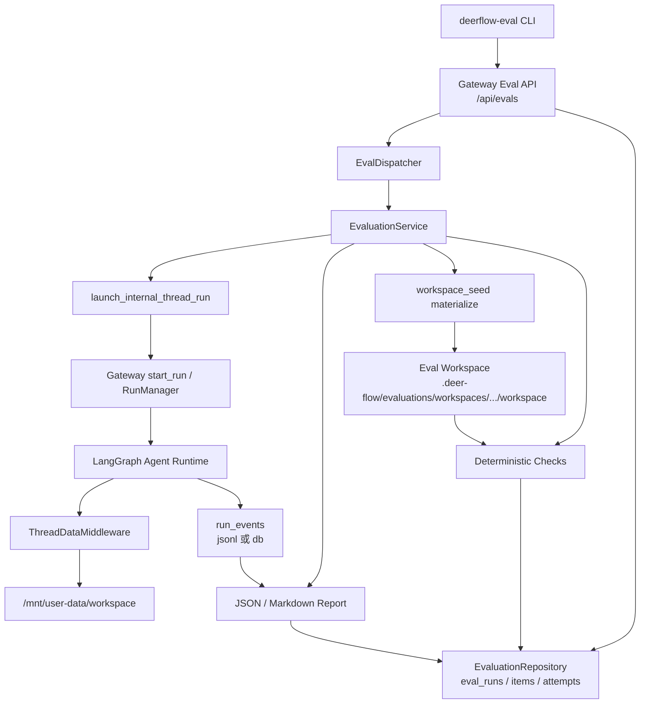

# DeerFlow Agent 评测平台 RFC

## 1. 决策摘要

DeerFlow 应提供一个内置 Agent 评测平台，用于运行真实或拟真的复杂任务，并把评测结论、执行 Trace、Workspace 产物和确定性 oracle 绑定到同一条可复现证据链。

P0 的核心决策如下：

1. **评测必须走真实 Gateway 运行链路**
   Eval item 不直接调用组件函数，而是通过 Gateway 内部 run launcher 启动 Agent，覆盖 `RunManager`、Agent runtime、middleware、工具调用、workspace 和 run events。

2. **评测报告必须默认包含 Trace 信息**
   JSON 和 Markdown 报告都要包含 `thread_id`、`run_id`、事件统计、原始 JSONL Trace 路径和 Gateway events API 路径。Trace 不是用户手动追问后再补的附加材料。

3. **评测必须使用持久化 run events**
   `run_events.backend=memory` 只适合临时运行，不满足可复现评测证据要求。Eval API 在 memory backend 下必须拒绝创建评测。

4. **复杂任务需要真实 workspace 映射**
   Suite seed materialize 后的 workspace 必须映射为 Agent 可见的 `/mnt/user-data/workspace`。否则 Agent 看不到 `request.md`、`policy.md`、`db.json`、测试文件等关键输入。

5. **评测运行必须非交互化**
   内部 eval run 设置 `non_interactive=true`，并自动设置 `disable_clarification=true`。评测任务不能因为 Agent 追问用户而挂住。

6. **复杂评测默认提高递归预算**
   Eval 内部 run 默认 `recursion_limit=300`，可通过 eval run config 覆盖。复杂工具任务、代码修复任务和多文档推理任务通常会超过普通聊天默认预算。

7. **失败归因优先保护外部阻塞证据**
   如果 run events 出现 `llm.error`、认证错误、上游服务错误或 quota/rate limit，报告应优先归类为 `external_blocked`，不能被后续 deterministic check 覆盖为 `deterministic_check_failed`。

8. **P0 不实现 LangSmith 同步**
   CLI 保留 `--sync langsmith` 入口，但当前版本仅支持本地观测链路。`--sync langsmith` 在 P0 中应显式报未实现，避免给出虚假外部同步承诺。

---

## 2. 背景与问题

DeerFlow 已具备完整 Agent runtime：Gateway、LangGraph runtime、middleware、sandbox、MCP、skills、memory、subagent 和 run events。缺口不在“能不能跑 Agent”，而在“能不能用专业任务稳定评估 Agent 能力边界，并保留足够证据解释结果”。

过去的简单 smoke case 只能回答两个问题：

- Agent 是否能启动。
- 某条最短路径是否能产出文件或文本。

这些问题不足以验证真实能力。真实平台评测还需要回答：

- Agent 能不能读懂多文件代码上下文并完成语义修复。
- Agent 能不能在带干扰文档的检索任务中只引用有效证据。
- Agent 能不能按政策约束调用本地工具，修改状态并避免禁止动作。
- 失败时到底是模型能力不足、外部服务阻塞、平台证据缺失，还是 oracle 设计问题。
- 报告能否直接定位到底层 Trace 和 workspace，而不是只给一个 pass/fail。

因此，评测平台的目标不是替代单元测试，而是提供“真实执行 + 结构化判分 + 可复现观测”的能力。

---

## 3. 目标

### 3.1 产品目标

1. 支持通过 Gateway API 和 `deerflow-eval` CLI 创建、运行和查看评测。
2. 支持本地 YAML/JSON suite，suite 是可复现评测输入的事实源。
3. 支持 baseline / candidate variant 对比。
4. 支持 workspace seed，让任务携带本地代码、文档、数据库、工具脚本和 oracle。
5. 支持确定性检查，包括文件存在、文件内容、命令退出码和 run event 存在性。
6. 默认生成 JSON 与 Markdown 报告。
7. 报告默认包含 Trace 调试元数据。
8. 支持复杂行业风格 suite：SWE-bench / RepoBench、GAIA / RAGAS、tau-bench / StableToolBench。
9. 失败分类可区分平台问题、外部阻塞、Trace 缺失和 Agent 任务失败。
10. 不持久化 API Key 等敏感凭证。

### 3.2 工程目标

1. 复用现有 Gateway run lifecycle，不新增第二套 Agent runtime。
2. 复用现有 run events 存储，不引入不可解释的黑盒 Trace。
3. 将评测状态、item、attempt 与报告持久化到数据库。
4. 每个 attempt 记录 `thread_id`、`run_id`、workspace、check results、metrics、run event summary 和 failure kind。
5. 让 retry / stale recovery 在数据库层保持幂等，不因旧 attempt 残留导致 unique constraint 冲突。
6. 对外部 caller 隐藏 host path override；`eval_workspace_path` 只能由内部 launcher 注入。
7. 用定向测试覆盖核心路径，并用真实复杂 suite 验证端到端价值。

---

## 4. 非目标

P0 不做以下事情：

1. 不提供前端评测管理页面。
2. 不把评测 API 开放给普通用户；仅 admin 或 internal caller 可用。
3. 不实现 LangSmith 真同步。
4. 不把 LLM-as-judge 作为硬门禁。
5. 不引入外部队列系统。
6. 不在 CLI 中默认处理超长运行的所有场景；复杂 live eval 可通过 Gateway API 长 timeout 调用。
7. 不将简单字符串匹配作为代码修复任务的主 oracle；代码任务必须优先使用测试命令或等价功能性 oracle。
8. 不在报告、进度文档、日志或命令中写入 API Key。

---

## 5. 设计原则

### 5.1 真实链路优先

评测必须覆盖用户实际会走到的系统路径。组件测试可以证明局部函数正确，但不能证明 Agent 在 Gateway、middleware、workspace、tools 和 run events 组合下能完成任务。

### 5.2 报告必须自带排查入口

报告不能只显示通过率。每个 item 至少要能追到：

- `thread_id`
- `run_id`
- run event counts
- 原始 JSONL Trace 路径
- Gateway events API path
- workspace path
- check results
- failure kind

### 5.3 确定性 oracle 优先

评测结论必须尽量由确定性 oracle 支撑。例如：

- 代码任务用 `python -m pytest -q`。
- 状态化工具任务用 `assert_policy_state.py` 检查 `db.json` 和 `action_log.json`。
- RAG 任务用 `validate_answer.py` 检查证据引用、禁止证据和关键事实。

### 5.4 失败分类不能互相覆盖

外部凭证、上游服务、Trace 缺失、平台缺陷和 Agent 输出错误是不同问题。分类优先级必须避免把 `llm.error` 误判为普通 deterministic check failed。

### 5.5 安全边界必须内建

评测平台会处理 workspace path、模型调用、工具执行和本地文件。P0 必须做到：

- 不接受客户端传入的 `eval_workspace_path`。
- 不把 API Key 写入持久化结果。
- 不把 memory run events 当作可复现证据。
- 不允许非 admin 调用评测 API。

---

## 6. 总体架构

评测平台不是新的 Agent runtime，而是 Gateway 旁边的执行控制面和观测层。



读图方式：

1. CLI 或 API 创建 eval run。
2. Gateway 写入 `eval_runs` 和 `eval_run_items`。
3. Dispatcher 拉起 `EvaluationService`。
4. Service materialize suite workspace。
5. Service 通过内部 launcher 启动真实 Gateway run。
6. `ThreadDataMiddleware` 把 eval workspace 映射给 Agent。
7. Agent 执行后写入 run events。
8. Service 执行 deterministic checks。
9. Service 聚合 metrics、Trace、check results 和报告。

---

## 7. 核心模块

### 7.1 Gateway API

文件：`backend/app/gateway/routers/evals.py`

| API | 用途 |
| --- | --- |
| `POST /api/evals` | 创建 eval run，可选立即执行 |
| `GET /api/evals/{eval_run_id}` | 查询 eval run 状态和持久化字段 |
| `GET /api/evals/{eval_run_id}/items` | 查询 item 列表 |
| `POST /api/evals/{eval_run_id}/cancel` | 取消 eval run |
| `GET /api/evals/{eval_run_id}/report?format=json` | 获取 JSON 报告 |
| `GET /api/evals/{eval_run_id}/report?format=markdown` | 获取 Markdown 报告 |

访问控制：

- 必须是 admin 或 internal caller。
- 非登录请求返回 `401`。
- 非 admin/internal 返回 `403`。
- `run_events.backend=memory` 时创建 eval 返回 `409`。

### 7.2 EvaluationService

文件：`backend/app/evaluation/service.py`

职责：

1. 校验并归一化 suite snapshot。
2. 创建 eval run 和 expanded items。
3. materialize workspace seed。
4. 调用内部 Gateway run。
5. 拉取 run events。
6. 执行 deterministic checks。
7. 分类 failure kind。
8. 生成 metrics summary 和 report。
9. 持久化 attempt、item 和 run 结果。

关键实现决策：

- 默认 recursion limit 为 `300`。
- `run_config` 可通过 eval run config 覆盖。
- 每次 attempt 都记录 `workspace_path`、`thread_id`、`run_id` 和 `run_event_summary`。
- retry 前会关闭旧的 `queued` / `running` incomplete attempts，避免 stale attempt 影响后续重跑。

### 7.3 Gateway 内部 run launcher

文件：`backend/app/gateway/services.py`

内部 launcher 提供统一入口：

- scheduled task 使用它。
- eval run 使用它。
- 后续其他内部自动化任务也可以复用它。

关键行为：

1. 默认设置 `non_interactive=true`。
2. 如果是非交互运行，则设置 `disable_clarification=true`。
3. 可传入 `eval_workspace_path`，但只允许内部 launcher 注入。
4. 可传入 `run_config`，例如 `recursion_limit=300`。
5. 可等待 run 完成。
6. 可返回 run events。

`wait_for_run_completion` 不只等待流式 END sentinel，还会检查 RunManager 中的 terminal status。这样可以避免 run 已经结束但 stream 没有 END 时评测一直挂住。

### 7.4 ThreadDataMiddleware workspace 映射

文件：`backend/packages/harness/deerflow/agents/middlewares/thread_data_middleware.py`

当 runtime context 包含内部注入的 `eval_workspace_path` 时，middleware 会把该目录作为 Agent 可见的 workspace：

- `workspace_path` -> eval materialized workspace
- `uploads_path` -> workspace 同级 `uploads`
- `outputs_path` -> workspace 同级 `outputs`

这解决了真实评测中 Agent 看不到 seed 文件的问题。

### 7.5 Harness evaluation package

目录：`backend/packages/harness/deerflow/evaluation/`

| 文件 | 职责 |
| --- | --- |
| `schema.py` | suite、variant、item、workspace seed、checks、metrics schema |
| `loader.py` | 加载 YAML/JSON suite，生成规范化 snapshot 和 digest |
| `workspace_seed.py` | 将 local fixture materialize 到 eval workspace |
| `checks.py` | 执行 deterministic checks |
| `metrics.py` | 汇总 pass rate、variant metrics、baseline/candidate delta |
| `results.py` | attempt 归一化、failure kind 分类、selected attempts |
| `reports.py` | 生成 JSON 和 Markdown 报告 |
| `cli.py` | `deerflow-eval` CLI |

### 7.6 持久化

目录：`backend/packages/harness/deerflow/persistence/evaluations/`

核心表：

- `eval_runs`
- `eval_run_items`
- `eval_item_attempts`

迁移：

- `0004_evaluations.py`
- `0005_eval_run_environment_fingerprint.py`

`0005` 用于修复 schema drift：数据库 head 已到 `0004`，但 `eval_runs` 实际缺少 `environment_fingerprint_json` 字段时，能够继续安全升级。

---

## 8. 数据模型

### 8.1 `eval_runs`

`eval_runs` 是一次评测的顶层记录。

| 字段 | 含义 |
| --- | --- |
| `id` | eval run id，格式如 `eval-run-...` |
| `owner_id` | 发起人或 internal owner |
| `suite_name` | suite 名称 |
| `suite_version` | suite 版本 |
| `suite_digest` | suite snapshot digest |
| `suite_snapshot_json` | 不可变 suite snapshot |
| `environment_fingerprint_json` | 环境指纹 |
| `config_json` | 本次运行配置，如 `suite_path`、`sync`、`recursion_limit` |
| `variants_json` | baseline/candidate/custom variants |
| `status` | `queued`、`running`、`completed`、`failed`、`cancelled` 等 |
| `total_items` | 展开后的 item 数 |
| `report_json` | 聚合 JSON 报告 |
| `report_markdown` | 聚合 Markdown 报告 |

### 8.2 `eval_run_items`

`eval_run_items` 是 suite item 展开后的运行单元。

一个 suite item 会按以下维度展开：

- variant
- repeat sample index

关键字段：

| 字段 | 含义 |
| --- | --- |
| `suite_item_id` | suite 中的 item id |
| `variant_id` | baseline、candidate 或 custom variant |
| `sample_index` | repeat 后的样本序号 |
| `execution_key` | 幂等执行键 |
| `status` | item 当前状态 |
| `selected_attempt_id` | 当前选中的 attempt |
| `thread_id` / `run_id` | 对应真实 Agent run |
| `workspace_path` | item workspace |
| `check_results_json` | deterministic check 结果 |
| `metrics_json` | item metrics |

### 8.3 `eval_item_attempts`

`eval_item_attempts` 是每次尝试记录。

关键字段：

| 字段 | 含义 |
| --- | --- |
| `attempt_index` | 同一 item 下递增 |
| `status` | `running`、`success`、`failed` 等 |
| `failure_kind` | 失败分类 |
| `error` | 非敏感错误摘要 |
| `run_event_summary_json` | 事件数量和事件类型统计 |
| `started_at` / `finished_at` | 执行时间 |

---

## 9. Suite 设计

Suite 是评测输入的事实源。P0 支持 YAML/JSON。

### 9.1 基本结构

```yaml
name: industry_complex_tau_stabletool_policy
version: 1
requires:
  run_events_backend: persistent
variants:
  - id: baseline
    label: Baseline
  - id: candidate
    label: Candidate
items:
  - id: complex-tau-stabletool-exchange-policy
    type: tool_policy_task
    repeat: 1
    metric_tags:
      - task_success
    input:
      prompt: |
        Read /mnt/user-data/workspace/request.md and complete the task.
    workspace_seed:
      provider: local_fixture
      path: fixture
    checks:
      - type: workspace_file_exists
        path: resolution.json
      - type: command_exit_zero
        command:
          - python
          - assert_policy_state.py
```

### 9.2 支持的 item 输入形态

每个 item 必须且只能定义一种输入形态：

| 形态 | 字段 | 用途 |
| --- | --- | --- |
| 单轮输入 | `input.prompt` | coding、工具执行、单任务 |
| 多轮 turns | `turns` | 同一 session 内的多轮交互 |
| 多 session | `sessions` | memory / isolation / cross-thread 类评测 |

### 9.3 支持的 checks

| Check | 用途 |
| --- | --- |
| `workspace_file_exists` | 检查 Agent 是否产出指定文件 |
| `workspace_file_contains` | 检查文件内容包含或不包含指定文本 |
| `command_exit_zero` | 在 workspace 中执行本地 oracle |
| `run_event_exists` | 检查 Trace 中是否出现指定事件 |

代码修复任务应优先使用 `command_exit_zero` 跑测试，不应依赖固定代码片段字符串。

### 9.4 支持的 metric tags

| Tag | 含义 |
| --- | --- |
| `task_success` | 任务是否成功 |
| `preference` | 偏好遵循 |
| `cross_thread` | 跨会话记忆 |
| `isolation` | 会话隔离 |
| `correction` | 修正恢复 |
| `cost` | 成本指标 |

---

## 10. 复杂行业评测 Suite

P0 已包含以下 suite：

| Suite | 参考方向 | 评测目标 |
| --- | --- | --- |
| `coding_smoke` | 基础代码任务 | 验证最小代码评测路径 |
| `memory_multi_session` | 记忆/隔离 | 验证多 session 评测形态 |
| `swe_bench_mini` | SWE-bench | 小型代码修复 |
| `stable_tool_api` | StableToolBench | 工具 API 调用 |
| `gaia_ragas_grounded_qa` | GAIA / RAGAS | 证据问答 |
| `tau_bench_stateful_policy` | tau-bench | 状态化政策任务 |
| `complex_swe_repobench_multifile` | SWE-bench / RepoBench | 多文件代码修复 |
| `complex_gaia_ragas_evidence_dossier` | GAIA / RAGAS | 多文档证据归因与干扰排除 |
| `complex_tau_stabletool_policy` | tau-bench / StableToolBench | 状态化工具执行与禁止动作约束 |

三类复杂 suite 已用真实 DeepSeek LLM 跑通，并生成报告：

| 任务类型 | Suite | Eval Run | 结果 |
| --- | --- | --- | --- |
| 多文件代码修复 | `industry_complex_swe_repobench_multifile` | `eval-run-52abf163f6cd47559cabe00edf10d04e` | 100% 通过 |
| 多文档证据问答 | `industry_complex_gaia_ragas_evidence_dossier` | `eval-run-e0e075413513444784363c19a29f388d` | 100% 通过 |
| 状态化工具执行 | `industry_complex_tau_stabletool_policy` | `eval-run-11d7d542640b46e9b7740507ec48ad90` | 100% 通过 |

综合中文报告：

```text
backend/.deer-flow/evaluations/reports/complex-industry-eval-summary.zh.md
```

---

## 11. 观测数据

当前实现提供 6 层观测方式。

### 11.1 Eval Run 状态

来源：

- `GET /api/evals/{eval_run_id}`
- `eval_runs`

用途：

- 看评测是否 queued、running、completed、failed 或 cancelled。
- 看 suite digest、配置、总 item 数、报告摘要。

### 11.2 Item / Attempt 明细

来源：

- `GET /api/evals/{eval_run_id}/items`
- `eval_run_items`
- `eval_item_attempts`

用途：

- 看每个 item、variant、sample 的状态。
- 看 selected attempt。
- 看 failure kind、error、workspace、thread/run id。

### 11.3 Report 聚合报告

来源：

- `GET /api/evals/{eval_run_id}/report?format=json`
- `GET /api/evals/{eval_run_id}/report?format=markdown`
- `backend/.deer-flow/evaluations/reports/*.json`
- `backend/.deer-flow/evaluations/reports/*.md`

报告包含：

- suite 信息
- pass rate
- conclusion label
- baseline/candidate comparison
- item context
- check results
- Trace 表
- workspace path

### 11.4 Raw Trace / Run Events

来源：

- `.deer-flow/threads/{thread_id}/runs/{run_id}.jsonl`
- `GET /api/threads/{thread_id}/runs/{run_id}/events`

用途：

- 排查 Agent 实际看到了什么 prompt。
- 查看 LLM response、tool result、run error、llm error。
- 证明评测结果可复现、可审计。

### 11.5 Workspace / Artifact

来源：

- `.deer-flow/evaluations/workspaces/{eval_run_id}/.../workspace`

用途：

- 查看 seed 文件。
- 查看 Agent 产物。
- 运行本地 oracle。
- 复现失败任务。

### 11.6 Deterministic Oracle

来源：

- suite `checks`
- `check_results_json`
- report items

用途：

- 自动判分。
- 给出失败检查项。
- 避免只靠模型自评或人工观察判断通过。

---

## 12. 失败分类

P0 failure kind 包括：

| Failure Kind | 含义 |
| --- | --- |
| `deterministic_check_failed` | 任务执行了，但确定性检查失败 |
| `trace_gate_failed` | Trace gate 未通过，例如缺少必要事件 |
| `platform_evidence_missing` | 评测要求 run events，但证据缺失 |
| `external_blocked` | 外部服务、认证、quota、网络等阻塞 |
| `platform_defect` | 平台自身缺陷，如 stale attempt recovery |
| `infrastructure_error` | 基础设施错误 |
| `infrastructure_timeout` | 基础设施超时 |
| `agent_error` | Agent 执行错误 |

分类优先级原则：

1. `passed` 不应有 failure kind。
2. 取消优先归类为 `cancelled`。
3. Trace gate 明确失败时归类为 `trace_gate_failed`。
4. `llm.error`、认证错误、外部服务错误优先归类为 `external_blocked`。
5. 之后才看 deterministic check failure。

这避免了“DeepSeek 401 认证错误被错误显示为确定性检查失败”的问题。

---

## 13. 运行方式

### 13.1 前置配置

评测要求持久化 run events。推荐：

```yaml
run_events:
  backend: jsonl
  max_trace_content: 10240
  track_token_usage: true
```

如果使用真实模型，模型凭证应通过 `.env` 或安全环境变量注入。不要把 API Key 写入：

- RFC
- progress 文档
- shell 命令历史
- eval report
- run event payload

### 13.2 启动 Gateway

本地开发可启动禁用鉴权的 Gateway：

```bash
cd backend
env -u DEEPSEEK_API_KEY \
  DEER_FLOW_AUTH_DISABLED=1 \
  PYTHONPATH=. \
  uv run uvicorn app.gateway.app:app --host 127.0.0.1 --port 18005
```

说明：

- `env -u DEEPSEEK_API_KEY` 用于避免旧 shell 污染覆盖 `.env`。
- 端口可替换。
- 生产或共享环境不应使用 `DEER_FLOW_AUTH_DISABLED=1`。

### 13.3 使用 CLI 运行

```bash
cd backend
uv run deerflow-eval \
  --gateway-url http://127.0.0.1:18005 \
  run tests/fixtures/evaluation/industry_derived/complex_tau_stabletool_policy/suite.yaml \
  --start \
  --idempotency-key local-complex-tau-001
```

查看状态：

```bash
uv run deerflow-eval \
  --gateway-url http://127.0.0.1:18005 \
  status eval-run-xxxxxxxx
```

导出报告：

```bash
uv run deerflow-eval \
  --gateway-url http://127.0.0.1:18005 \
  report eval-run-xxxxxxxx --format markdown
```

### 13.4 长任务运行

当前 CLI HTTP timeout 是 60 秒。复杂真实 LLM 任务可能超过 60 秒。

临时方案：

- 使用 Gateway API，并把 HTTP client timeout 调大。
- 或先创建 eval run，再由 dispatcher 执行，之后用 status/report 查询。

后续应给 CLI 增加 `--timeout-seconds`。

---

## 14. 报告格式

### 14.1 JSON 报告

核心结构：

```json
{
  "schema_version": "deerflow.evaluation.report.v1",
  "eval_run_id": "eval-run-...",
  "suite": {
    "name": "industry_complex_tau_stabletool_policy",
    "item_count": 1
  },
  "summary": {
    "total_attempts": 2,
    "passed_attempts": 2,
    "pass_rate": 1.0,
    "conclusion_label": "neutral"
  },
  "items": [
    {
      "suite_item_id": "complex-tau-stabletool-exchange-policy",
      "variant_id": "baseline",
      "status": "passed",
      "thread_id": "...",
      "run_id": "...",
      "workspace_path": "...",
      "run_event_summary": {
        "event_count": 10,
        "event_types": {
          "run.start": 1,
          "llm.ai.response": 3,
          "llm.tool.result": 4,
          "run.end": 1
        }
      },
      "trace": {
        "thread_id": "...",
        "run_id": "...",
        "events_api_path": "/api/threads/.../runs/.../events",
        "local_jsonl_path": ".deer-flow/threads/.../runs/....jsonl"
      }
    }
  ]
}
```

### 14.2 Markdown 报告

Markdown 报告必须包含：

- `Summary`
- `Comparison`
- `Trace`
- `Item Context`
- `Items`

当前 `Items` 表中的 `Checks` 列表示失败检查数与总检查数，例如 `0/9` 表示 0 个失败、共 9 个检查。后续建议改名为 `Failed Checks` 或同时展示 `Passed Checks`，降低误读。

---

## 15. 安全与隔离

### 15.1 API 权限

Eval API 仅允许 admin 或 internal caller 调用。普通用户不能直接创建评测。

### 15.2 Workspace Path 防护

`eval_workspace_path` 是内部 runtime-only key：

- 外部 client 传入时必须被剥离。
- 只有内部 launcher 能写入 runtime context。
- Agent 只看到 `/mnt/user-data/workspace` 抽象，不直接决策 host path。

### 15.3 凭证防护

评测过程不得持久化明文 API Key。

报告中允许出现：

- provider 错误类型
- HTTP status
- redacted key
- 非敏感错误摘要

报告中不允许出现：

- `sk-...` 等完整密钥
- `.env` 原文
- shell 中拼接的明文凭证

### 15.4 非交互约束

评测内部 run 必须设置：

- `non_interactive=true`
- `disable_clarification=true`

这样可避免模型在评测中调用澄清工具等待人工输入。

---

## 16. 可运维性

### 16.1 run events backend

| Backend | 是否可用于 eval | 说明 |
| --- | --- | --- |
| `memory` | 否 | 进程重启丢失，不可复现 |
| `jsonl` | 是 | 推荐本地开发和报告追溯 |
| `db` | 是 | 适合集中存储和 API 查询 |

### 16.2 Workspace 保留

P0 默认保留 eval workspace，方便复现和排查。

后续可以增加 retention policy：

- 成功项保留 N 天。
- 失败项保留更长时间。
- 大文件可转移或压缩。

### 16.3 Dispatcher

EvalDispatcher 在 Gateway lifespan 中启动和停止。

需要注意：

- 多个 Gateway 进程可能竞争 queued eval。
- 如果旧 Gateway 没有加载最新代码，可能生成旧格式报告。
- 运行真实评测前应确认只使用干净、最新的 Gateway 进程。

---

## 17. 验证结果

P0 已通过以下验证：

### 17.1 真实复杂 LLM 评测

| Suite | 结果 |
| --- | --- |
| `industry_complex_swe_repobench_multifile` | 100% 通过 |
| `industry_complex_gaia_ragas_evidence_dossier` | 100% 通过 |
| `industry_complex_tau_stabletool_policy` | 100% 通过 |

这些任务覆盖：

- 多文件代码修复与 pytest oracle。
- 多文档证据问答、干扰证据排除和本地 validator。
- 状态化工具调用、政策约束、禁止退款动作和本地状态 oracle。

### 17.2 定向测试

已验证的测试范围包括：

- evaluation schema / loader / checks / reports / results
- Gateway eval router
- EvaluationService
- EvaluationRepository
- persistence bootstrap / migration
- Gateway internal launcher
- run completion wait fallback
- fixture collection isolation

最近一次自检中以下命令通过：

```bash
uv run pytest tests/test_evaluation_core.py tests/test_evaluation_gateway.py tests/test_gateway_services.py -q
uv run ruff check app/gateway/app.py app/gateway/services.py app/evaluation packages/harness/deerflow/evaluation packages/harness/deerflow/agents/middlewares/thread_data_middleware.py tests/test_evaluation_core.py tests/test_evaluation_gateway.py tests/test_gateway_services.py
uv run ruff format --check app/gateway/app.py app/gateway/services.py app/evaluation packages/harness/deerflow/evaluation packages/harness/deerflow/agents/middlewares/thread_data_middleware.py tests/test_evaluation_core.py tests/test_evaluation_gateway.py tests/test_gateway_services.py
```

结果：

- `95 passed`
- `ruff check` 通过
- `ruff format --check` 通过

此前 broad 验收还覆盖过后端全量测试，结果为 6900+ 项通过。

---

## 18. 改动范围

### 18.1 必须保留的核心改动

| 模块 | 原因 |
| --- | --- |
| `backend/app/evaluation/` | Eval dispatcher 和 service |
| `backend/app/gateway/routers/evals.py` | Eval API |
| `backend/app/gateway/app.py` | 注册 router 和启动 dispatcher |
| `backend/app/gateway/deps.py` | 注入 evaluation repository |
| `backend/app/gateway/services.py` | 内部 run launcher、等待完成和 run events 返回 |
| `thread_data_middleware.py` | eval workspace 映射 |
| `deerflow/evaluation/` | suite schema、loader、checks、reports、results、CLI |
| `persistence/evaluations/` | eval 持久化 |
| `0004` / `0005` migrations | 表结构和 schema drift 修复 |
| `tests/fixtures/evaluation/` | P0 和复杂行业 suite |
| `tests/test_evaluation_*` | 评测平台回归测试 |

### 18.2 可后续收缩的改动

| 项 | 建议 |
| --- | --- |
| CLI timeout | 增加 `--timeout-seconds`，减少复杂任务手写 HTTP client 的需要 |
| Markdown `Checks` 列 | 改为 `Failed Checks` 或同时展示通过数 |
| 成功 workspace 保留策略 | 增加 retention policy |
| LangSmith sync | 要么实现，要么从 CLI 帮助中弱化 |
| 报告中文渲染 | 可增加 `--locale zh-CN`，避免手写中文报告 |

### 18.3 不建议纳入本 RFC 的改动

以下文件看起来与评测平台主链路无直接关系，不建议和本 RFC 同 PR 提交，除非另有背景：

- `docs/plans/2026-07-08-mcp-routing-hints-rfc.md`
- `docs/plans/2026-07-09-mcp-routing-auto-promote-rfc.md`
- `docs/plans/2026-07-10-agent-tool-allow-deny-rfc.md`
- `docs/plans/2026-07-10-skill-reviewer-rfc.md`

---

## 19. 风险与应对

| 风险 | 影响 | 应对 |
| --- | --- | --- |
| Gateway 旧进程未重启 | 报告格式或分类逻辑仍是旧行为 | 真实评测前确认端口进程是最新代码 |
| `run_events.backend=memory` | Trace 丢失，报告不可复现 | Eval API 直接拒绝 |
| CLI 60 秒 timeout | 复杂 LLM eval 被客户端中断 | 后续加 `--timeout-seconds`；当前可用长 timeout API |
| 复杂 suite 过拟合本地 fixture | 对真实能力覆盖不足 | 持续引入更多行业任务和变体 |
| deterministic oracle 太弱 | 通过率虚高 | 代码任务用测试，工具任务用状态检查，RAG 任务用 validator |
| deterministic oracle 太窄 | 语义正确但被误杀 | 避免固定代码片段检查，优先验证行为 |
| 多 Gateway 抢占任务 | queued eval 被旧进程执行 | 引入 worker identity 或更明确的 dispatcher lease 观测 |
| 报告字段被误读 | 用户误以为成功任务失败 | 优化 Markdown 表头和中文渲染 |
| Workspace 长期堆积 | 本地磁盘增长 | 增加 retention 和清理命令 |

---

## 20. 后续路线

### M1：P0 稳定化

- 保持当前 P0 能力。
- 修正 Markdown `Checks` 表意。
- 给 CLI 增加 timeout 参数。
- 增加报告中文渲染选项。
- 增加 workspace retention 配置。

### M2：评测管理能力

- 增加前端评测页面。
- 支持查看 run、item、attempt、Trace 和 workspace artifact。
- 支持重新运行失败 item。
- 支持 suite registry。

### M3：外部观测与规模化

- 实现 LangSmith sync。
- 支持更高并发和 worker identity。
- 支持更多 benchmark adapter。
- 支持成本统计和 token trend。
- 接入 CI/CD 的非阻断或阻断门禁。

### M4：评测治理

- 建立 suite 质量标准。
- 建立 oracle 质量审查。
- 建立报告审计模板。
- 建立失败分类 dashboard。

---

## 21. 验收标准

P0 可被接受的标准：

1. `run_events.backend=jsonl` 或 `db` 时可以创建并运行 eval。
2. `run_events.backend=memory` 时 eval 创建被拒绝。
3. Agent 能读取 eval seed workspace 中的文件。
4. 非交互 eval 不会调用澄清工具阻塞。
5. 复杂 suite 不因默认递归预算过低而提前中断。
6. `llm.error` 能优先归类为 `external_blocked`。
7. JSON 报告每个 item 默认包含 `trace`。
8. Markdown 报告默认包含 `## Trace` 表。
9. 代码任务使用功能性 oracle，而非固定字符串检查。
10. 三类复杂行业 suite 至少各有一条真实运行报告。
11. 定向测试、ruff check 和 format check 通过。
12. 报告和文档中不包含明文 API Key。

---

## 22. 未决问题

1. 是否将 `deerflow-eval report` 增加 `--output` 参数，直接写入本地报告文件。
2. 是否将 report Markdown 默认本地化为中文，还是提供 `--locale`。
3. 是否把 run events 的 token/cost 统计提升为报告一级字段。
4. 是否为 eval dispatcher 增加独立 worker id 和抢占观测。
5. 是否允许 suite 声明最小 recursion limit。
6. 是否需要把 suite fixture 的大型数据移出 Git，改为可下载 dataset。
7. 是否在前端展示 JSONL Trace，还是只链接到 API。

---

## 23. 附录：关键路径

### 23.1 配置

```text
config.yaml
```

### 23.2 Suite

```text
backend/tests/fixtures/evaluation/
```

### 23.3 Workspace

```text
backend/.deer-flow/evaluations/workspaces/{eval_run_id}/.../workspace
```

### 23.4 报告

```text
backend/.deer-flow/evaluations/reports/{eval_run_id}.json
backend/.deer-flow/evaluations/reports/{eval_run_id}.md
```

### 23.5 Raw Trace

```text
backend/.deer-flow/threads/{thread_id}/runs/{run_id}.jsonl
```

### 23.6 Gateway Trace API

```text
GET /api/threads/{thread_id}/runs/{run_id}/events
GET /api/threads/{thread_id}/runs/{run_id}/workspace-changes
```

---

## 24. 附录：术语

| 术语 | 说明 |
| --- | --- |
| Eval Run | 一次完整评测执行 |
| Suite | 评测定义文件 |
| Item | suite 中的一个任务定义 |
| Variant | baseline、candidate 或 custom 运行变体 |
| Attempt | item 的一次执行尝试 |
| Workspace Seed | 评测前复制到 workspace 的输入文件 |
| Deterministic Oracle | 可重复执行的自动判分逻辑 |
| Trace Gate | 检查 run events 是否满足最低可观测要求 |
| Run Events | Agent 运行事件流，是本地 Trace 事实源 |
| Failure Kind | 失败归因分类 |
| `external_blocked` | 外部服务、认证、quota 或网络导致的阻塞 |
| `platform_evidence_missing` | 评测缺少必要运行证据 |
